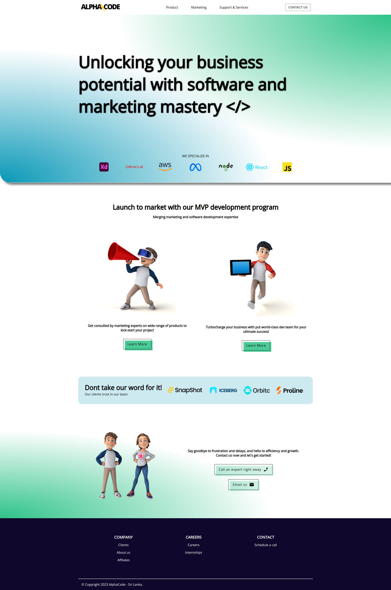
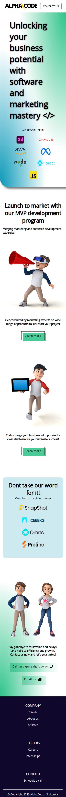

# AlphaCode Landing Page

A modern, responsive landing page for AlphaCode — showcasing software development and marketing expertise. Built with React, Vite, and Material UI.

## Overview

AlphaCode's landing page presents the company's services and values through a clean, contemporary interface. The site highlights expertise in MVP development, marketing consultation, and software solutions, designed to engage potential clients and partners.

## Tech Stack

- **React 18** — UI library
- **Vite** — Build tool and dev server
- **Material UI (MUI)** — Component library
- **Styled Components** — CSS-in-JS styling
- **Emotion** — MUI styling engine

## Features

- Responsive design (mobile, tablet, desktop)
- Modern dark theme with gradient accents
- Smooth scroll navigation
- Contact section with email and GitHub links
- Expertise cards for Marketing & Development services
- Client trust section with logo showcase
- Sticky navbar with backdrop blur

## Project Structure

```
alphacode-landingpage/
├── public/           # Static assets
├── src/
│   ├── assets/       # Images and icons
│   ├── components/   # React components
│   │   ├── Navbar.jsx
│   │   ├── Hero.jsx
│   │   ├── HeroIcons.jsx
│   │   ├── Expertise.jsx
│   │   ├── WorkDone.jsx
│   │   ├── TalkToUs.jsx
│   │   └── Footer.jsx
│   ├── App.jsx
│   ├── index.css     # Global styles & CSS variables
│   ├── main.jsx
│   └── themeSettings.js
├── index.html
├── package.json
└── vite.config.js
```

## Getting Started

### Prerequisites

- Node.js 16+ 
- npm or yarn

### Installation

```bash
# Clone the repository
git clone https://github.com/sam-holtz/alphacode-landingpage.git
cd alphacode-landingpage

# Install dependencies
npm install
```

### Development

```bash
npm run dev
```

Runs the app in development mode at `http://localhost:5173`.

### Build

```bash
npm run build
```

Creates an optimized production build in the `dist` folder.

### Preview Production Build

```bash
npm run preview
```

Serves the production build locally for testing.

## Contact

- **Email:** [samholtz1205@gmail.com](mailto:samholtz1205@gmail.com)
- **GitHub:** [github.com/sam-holtz](https://github.com/sam-holtz)

## Screenshots

| Desktop | Mobile |
|---------|--------|
|  |  |

## License

Private project. All rights reserved.
